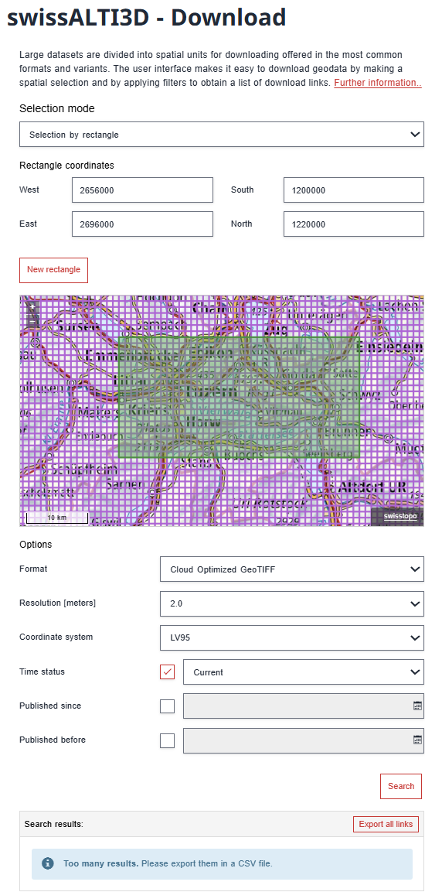
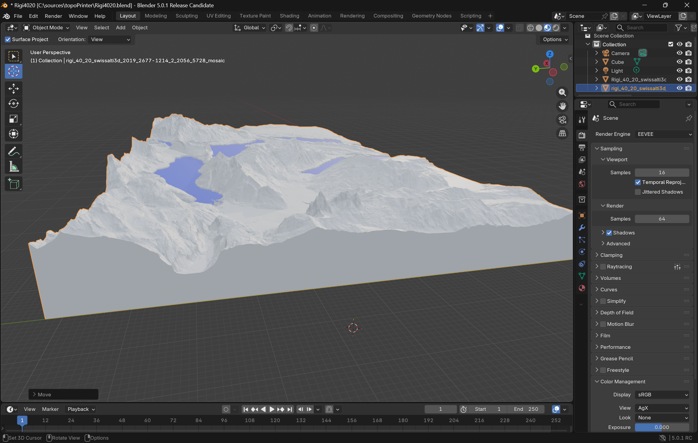

# DEM Batch to STL

Command-line tool to convert GeoTIFF DEM tiles into watertight binary STL relief blocks sized for 3D printing. It downloads DEMs, mosaics them, and builds a solid mesh with a flat base. Tested with swissALTI3D tiles from SwissTopo but works for any GeoTIFF DEMs with matching CRS and pixel size.

## Requirements

- Python 3.8+ recommended
- `pip install -r requirements.txt`

Notes:
- `rasterio` depends on GDAL; if pip install fails, install GDAL via your OS package manager and retry.

## Quick start

```bash
python dem_batch_to_stl.py --url-list urls.txt \
    --output-dir ./stl_output \
    --x-size-mm 200 \
    --max-height-mm 40 \
    --z-exaggeration 1.5 \
    --downsample 2 \
    --base-thickness-mm 2 \
    --lake-range-percent 2 \
    --lake-lowering-mm 100
```

## Install

```bash
python -m venv .venv
source .venv/bin/activate
pip install -r requirements.txt
```

## Inputs

`--url-list` supports:
- Plain text (.txt): one URL per line, `#` for comments.
- CSV (.csv): scans all cells for values starting with `http`.
- Excel (.xlsx): uses the first sheet and reads cells for `http` values.
- `.xls` fallback: if an `.xls` is actually plain text, it is parsed as text; true binary `.xls` should be saved as `.xlsx` or `.txt`.

All URLs in the list are merged into a single mosaic.

## Getting SwissTopo URLs (step-by-step)

Use the SwissTopo swissALTI3D coordinate tool to define your rectangle, then export the link list as CSV.
Page: https://www.swisstopo.admin.ch/en/height-model-swissalti3d
Place the CSV in your project folder (or a subfolder like `xls_inputs/`) and pass it to `--url-list`.



Description of the screenshot:
1. Enter coordinate bounds for your rectangle region.
2. Generate and copy the list of links in CSV form.
3. Save the CSV and use it with `--url-list` (for example, place it under `xls_inputs/`).

SwissTopo provides GeoTIFF (`.tif`) DEM tiles. This tool converts those `.tif` files into a printable `.stl`,
which you can preview in Blender before sending to your 3D printer.

## Visualizing the STL in Blender

You can import the generated `.stl` into Blender to preview the terrain mesh.



## Outputs

- A single STL named after the URL list file and first tile, with `_mosaic` if more than one DEM is used.
- A `_water.stl` is also written when lake lowering is enabled and any lake faces are detected.
- Temporary downloads are kept in `output-dir/tmp_dem`.
- A persistent cache lives in `cache/` next to the scripts. Delete its contents to force re-downloads.

Output naming example for `urls.txt` and a first tile of `N46E008_1m.tif`:

`urls_N46E008_1m_mosaic.stl`

## How it works

1. **Download and cache**: Each URL is fetched to `output-dir/tmp_dem` and also cached in `cache/`. Existing cache entries are reused.
2. **Merge and fill**: DEMs are mosaicked with `rasterio.merge`. Nodata cells are replaced with the minimum valid elevation so masked water does not float above surrounding terrain. Optional downsampling happens after merge.
3. **Scale and normalize**: The model X dimension is set to `--x-size-mm`. Y is derived from pixel aspect ratio. Elevations are normalized into `--max-height-mm` with a flat base thickness and optional `--z-exaggeration`.
4. **Lake lowering (optional)**: Cells within `--lake-range-percent` above the minimum elevation are treated as lakes and lowered by `--lake-lowering-mm`.
5. **Mesh build**: A watertight mesh is generated with top surface, base, and side walls. X is flipped for a viewer-friendly orientation.
6. **Export STL**: The result is saved as a binary STL. If lake lowering is active, a second STL is exported for the lake volumes.

The tool skips failed downloads but continues if at least one DEM succeeds. It exits non-zero if no STL is produced.

## CLI reference

- `--url-list` (required): URL list file to read and merge.
- `--output-dir` (required): directory to write STL files into.
- `--x-size-mm` (default 200): physical width in mm for the X axis.
- `--max-height-mm` (default 30): total model height including the base.
- `--z-exaggeration` (default 1.0): vertical exaggeration factor applied to relief.
- `--downsample` (default 1): integer factor to thin the DEM grid, must be `>= 1`.
- `--base-thickness-mm` (default 2): flat base thickness; should be `<= max-height-mm`.
- `--lake-range-percent` (default 0): percent above min elevation treated as lake; set `> 0` to enable lake lowering.
- `--lake-lowering-mm` (default 0): millimeters to lower lake surfaces; set `> 0` to enable lake lowering.

## Notes and assumptions

- All DEM tiles must share the same CRS and pixel size, or the merge will fail.
- If a DEM has only nodata values, the run aborts.
- Large mosaics can use a lot of RAM; use `--downsample` to keep meshes manageable.

## Project layout

- `dem_batch_to_stl.py`: CLI entry point and orchestration.
- `downloader.py`: URL list parsing, filename derivation, HTTP download with caching.
- `dem_processing.py`: DEM merging, nodata handling, optional downsampling.
- `mesh_builder.py`: Mesh vertex/face generation and STL export.
