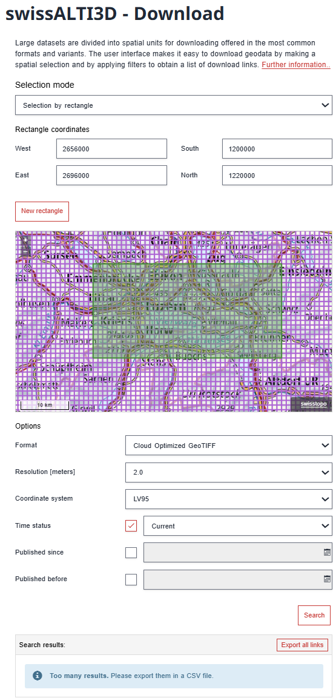
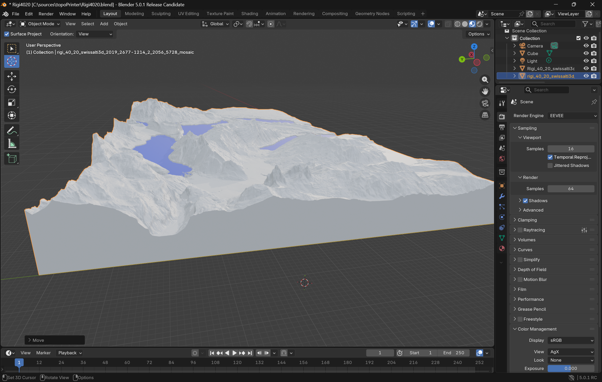
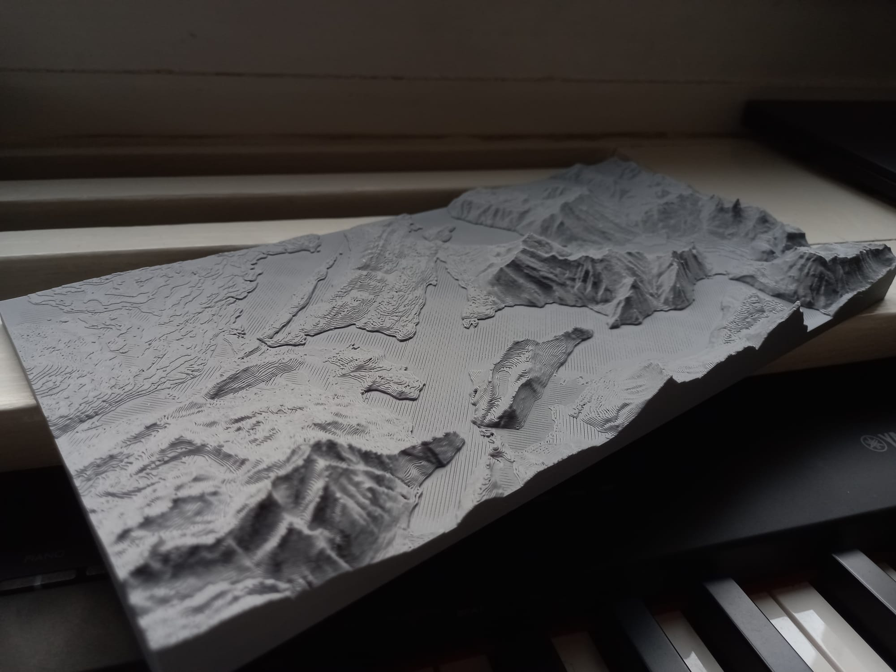

# DEM Batch to STL

Command-line tool to convert DEM tiles into watertight binary STL relief blocks sized for 3D printing. It downloads DEMs, mosaics them, and builds a solid mesh with a flat base.

Supports both GeoTIFF (`.tif`) and ASCII Grid (`.asc`) formats. Works with Swiss swissALTI3D, Slovenian ARSO DMR, and any other DEM tiles accessible via HTTP/HTTPS with matching CRS and pixel size.

## Requirements

- Python 3.8+ recommended
- GDAL system libraries (see installation instructions below)
- `pip install -r requirements.txt`

### Installing GDAL system libraries

GDAL is required for reading DEM files and converting XYZ point clouds to rasters.

**Ubuntu/Debian:**
```bash
sudo apt update
sudo apt install -y libgdal-dev
```

**Windows 11:**

Download and install pre-compiled GDAL wheel from https://www.lfd.uci.edu/~gohlke/pythonlibs/#gdal

Choose the wheel matching your Python version and architecture (e.g., `GDAL‑3.x.x‑cp313‑cp313‑win_amd64.whl` for Python 3.13 64-bit), then:
```bash
pip install GDAL‑3.x.x‑cp313‑cp313‑win_amd64.whl
pip install -r requirements.txt
```

Notes:
- On Linux, if `pip install GDAL` fails, you may need to match the Python bindings version to your system GDAL library version
- Check library version: `pkg-config --modversion gdal`
- Install matching version: `pip install GDAL==<version>`

## Quick start

```bash
python dem_batch_to_stl.py --url-list urls.txt \
    --output-dir ./stl_output \
    --x-size-mm 200 \
    --max-height-mm 40 \
    --z-exaggeration 1.5 \
    --downsample 2 \
    --base-thickness-mm 4 \
    --lake-range-percent 2 \
    --lake-lowering-mm 1.5
```

## Install

```bash
python -m venv .venv
source .venv/bin/activate
pip install -r requirements.txt
```

## Inputs

`--url-list` supports:
- Plain text (.txt): one URL per line, `#` for comments.
- CSV (.csv): scans all cells for values starting with `http`.
- Excel (.xlsx): uses the first sheet and reads cells for `http` values.
- `.xls` fallback: if an `.xls` is actually plain text, it is parsed as text; true binary `.xls` should be saved as `.xlsx` or `.txt`.

All URLs in the list are merged into a single mosaic.

## Getting Swiss SwissTopo URLs (step-by-step)

Define your rectangle area in the SwissTopo swissALTI3D tool (https://www.swisstopo.admin.ch/en/height-model-swissalti3d), then export the link list as CSV.
Place the CSV in your project folder (or a subfolder like `xls_inputs/`) and pass it to `--url-list`.



Description of the screenshot:
1. Enter coordinate bounds for your rectangle region.
2. Press the "Export all links" button (bottom-right) to generate and copy the list of links in CSV form.
3. Save the CSV and use it with `--url-list` (for example, place it under `xls_inputs/`).

SwissTopo provides GeoTIFF (`.tif`) DEM tiles. This tool converts those `.tif` files into a printable `.stl`,
which you can preview in Blender before sending to your 3D printer.

## Getting Slovenian ARSO URLs

For Slovenian terrain data, visit the ARSO geoportal (https://gis.arso.gov.si/) to access DMR1 (Digital Terrain Model) data.

1. Navigate to the ARSO lidar data portal
2. Select your area of interest
3. Export the list of DMR1 tile URLs (ASCII Grid `.asc` format with D48GK or D96TM projection)
4. Save the URLs to a text file (e.g., `xls_inputs/slovenia_tiles.txt`)
5. Use the same command as for Swiss data

Example Slovenian URL format:
```
http://gis.arso.gov.si/lidar/dmr1/b_456/D48GK/DMR1_456_100.asc
```

## Visualizing the STL in Blender

You can import the generated `.stl` into Blender to preview the terrain mesh.



## Physical 3D-printed result

Example of what a finished print can look like:



## Outputs

- A single STL named after the URL list file and first tile, with `_mosaic` if more than one DEM is used.
- When the print resolves into separate bodies (water, glacier, foliage inserts and the base plate they seat into), each is written with its terrain class appended: `_rock.stl`, `_water.stl` and so on.
- Temporary downloads are kept in `output-dir/tmp_dem`.
- A persistent cache lives in `cache/` next to the scripts. Delete its contents to force re-downloads.

Output naming example for `urls.txt` and a first tile of `N46E008_1m.tif`:

`urls_N46E008_1m_mosaic.stl`

## How it works

1. **Download and cache**: Each URL is fetched to `output-dir/tmp_dem` and also cached in `cache/`. Existing cache entries are reused. File format (GeoTIFF `.tif` or ASCII Grid `.asc`) is auto-detected from the URL.
2. **Merge and fill**: DEMs are mosaicked with `rasterio.merge`. Nodata cells are replaced with the minimum valid elevation so masked water does not float above surrounding terrain. Optional downsampling happens after merge.
3. **Scale and normalize**: The model X dimension is set to `--x-size-mm`. Y is derived from pixel aspect ratio. Elevations are normalized into `--max-height-mm` with a flat base thickness and optional `--z-exaggeration`.
4. **Terrain masks (optional)**: Each mask provider contributes polygons for its terrain class -- OSM (`--terrain`), satellite snow/foliage GeoJSON, and ground below `--lake-range-percent` of the relief read straight off the DEM as water. With no provider the print is one class covering everything.
5. **2D layout**: Masks are resolved into mutually exclusive, printable regions in model millimetres: one base plate, the pockets cut into it, and the insert footprints that seat in them with their clearances. Every xy coordinate the STL will carry is decided here, including the cutout.
6. **Mesh build**: Those regions are extruded over the DEM -- the only stage that adds Z. The base plate is one watertight terraced solid; each insert is a prism, dropped by `--lake-lowering-mm` for water.
7. **Export STL**: Each body is saved as a binary STL.

The tool skips failed downloads but continues if at least one DEM succeeds. It exits non-zero if no STL is produced.

## CLI reference

- `--url-list` (required): URL list file to read and merge.
- `--output-dir` (required): directory to write STL files into.
- `--x-size-mm` (default 200): physical width in mm for the X axis.
- `--max-height-mm` (default 30): total model height including the base.
- `--z-exaggeration` (default 1.0): vertical exaggeration factor applied to relief.
- `--downsample` (default 1): integer factor to thin the DEM grid, must be `>= 1`.
- `--base-thickness-mm` (default 2): flat base thickness; should be `<= max-height-mm`.
- `--lake-range-percent` (default 0): percent of the relief above the minimum elevation read as water; set `> 0` to print that ground as a separate water body.
- `--lake-lowering-mm` (default 0): millimetres to sink the water body below the ground it seats in, flat-topped; `0` leaves it flush and draped at the DEM.

## Notes and assumptions

- All DEM tiles must share the same CRS and pixel size, or the merge will fail.
- If a DEM has only nodata values, the run aborts.
- Large mosaics can use a lot of RAM; use `--downsample` to keep meshes manageable.

## Project layout

- `dem_batch_to_stl.py`: CLI entry point and orchestration.
- `downloader.py`: URL list parsing, filename derivation, HTTP download with caching.
- `dem_processing.py`: DEM merging, nodata handling, optional downsampling.
- `mesh_builder.py`: Mesh vertex/face generation and STL export.
